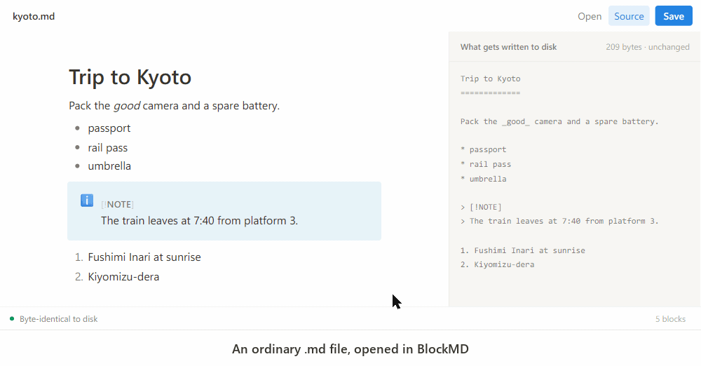

# BlockMD

**A Notion-style block editor whose files are just plain `.md`.**



**[Download for Windows and macOS](https://ruiquanqiao.github.io/BlockMD/download.html)** · free and open source

Open a Markdown file, edit it with drag handles and a slash menu, save it — and the
bytes you didn't touch come back exactly as they were. Not "semantically equivalent".
Byte-for-byte identical.

> [!WARNING]
> Pre-alpha. The persistence engine is built and tested; the UI is an early prototype.
> Not ready for your real notes yet.

---

## The problem

Every block editor stores its documents in a proprietary format. Every plain-Markdown
editor is a line-oriented text editor. Nobody occupies both cells:

| | Block editing | Files are plain `.md` | Lightweight |
|---|---|---|---|
| Notion, AppFlowy, AFFiNE, SiYuan, Logseq 2.0 | ✅ | ❌ | ❌ |
| Obsidian, Typora, MarkText | ❌ | ✅ | partly |
| **BlockMD** | ✅ | ✅ | ✅ |

This is not an oversight by those projects — it is an architectural consequence.
AppFlowy stores documents in its own database, AFFiNE in a Yjs CRDT, SiYuan in `.sy`
JSON. Logseq 2.0 migrated *away* from Markdown files to SQLite in July 2026.

## Why "byte-for-byte" is the hard part

The obvious approach — parse to an AST, edit, serialize back — **cannot** preserve
bytes. It is not a bug to be fixed; it is a property of the format. These pairs parse
to identical trees, so any serializer must pick one:

| Same tree, different bytes | |
|---|---|
| `*italic*` | `_italic_` |
| `- item` | `* item` |
| `# Heading` | `Heading`<br>`=======` |
| ` ```code``` ` | `~~~code~~~` |

`mdast-util-to-markdown` says so in its own documentation: *complete roundtripping is
impossible*. This is why "opened a file, changed nothing, and the diff is now noisy"
is a recurring complaint against WYSIWYG Markdown editors.

### Surgical splicing

BlockMD uses the AST only to **locate** blocks, never to **produce** output.

```
1. Parse   → mdast, each top-level node carrying its source offsets
2. Edit    → reconcile old/new ProseMirror nodes by object identity
3. Save    → untouched block  →  copy source.slice(start, end) verbatim
             edited block     →  re-serialize only that block
```

A document opened and saved without edits is identical **by construction**, not by
luck. And because ProseMirror nodes are persistent immutable structures, a block that
was merely *moved* still matches by reference — so dragging a block to a new position
re-serializes **nothing at all**.

Measured across 10 edit scenarios, blocks needing re-serialization:

| | via step maps | via identity reconciliation | theoretical minimum |
|---|---|---|---|
| Drag to reorder | 5 | **0** | 0 |
| Delete a block | 3 | **0** | 0 |
| Total | 27 | **8** | **8** |

## Current state

**Works**

- Byte-identical open → save, verified on 22 hand-built fixtures and 14 real-world
  READMEs (~98 KB, 610 top-level blocks)
- Desktop app (Tauri 2): open, save, save-as, `Ctrl+S`, drag a file onto the window,
  launch from a file association, and a confirmation before unsaved work is discarded
- Drag-to-reorder with zero re-serialization
- Slash menu: paragraph, headings, lists, task list, quote, code block, divider
- Link definitions (`[ref]: url`) and YAML front matter survive round trips even
  though the editor does not render the former
- Live fidelity indicator in the status bar

**Not yet**

- Visual design — functional, but not yet the calm typographic feel it is aiming for
- Side-by-side columns
- Per-file encryption
- Block references (see Non-goals)
- Automated tests for the UI layer

## Non-goals

Stated up front so expectations are calibrated:

- **Cross-document block references.** The only feature that would require persistent
  block IDs written into your files. Dropping it is what keeps `.md` clean.
- **Database views, relations, rollups.** No representation in Markdown, and Notion's
  own export loses them to CSV.
- **Synced blocks.** Same reason as block references.
- **Real-time collaboration.** Needs resident CRDT state, which conflicts with "the
  file is the single source of truth".

## Getting started

### Install it

```bash
npm install
npm run desktop:build
```

The installers land in `src-tauri/target/release/bundle/` — a 2 MB NSIS `-setup.exe`
and a 1.8 MB `.msi` on Windows. For comparison, MarkText ships 128 MB and SiYuan 237 MB;
the difference is Tauri reusing the system WebView instead of bundling Chromium.

Installing puts BlockMD in the **Open with** list for `.md` and `.markdown`, and in
Settings → Default apps. Windows will not let an installer *take* the default —
`UserChoice` is hash-protected on purpose — so the last step is yours, once:

> right-click any `.md` → **Open with** → **Choose another app** → **BlockMD** →
> tick *Always use this app*

To check what Windows actually offers for an extension — which is not the same
question as "is the ProgId in the registry":

```bash
npm run check:assoc
```

Both installers register BlockMD identically. The `.msi` exists for unattended
deployment (`msiexec /i BlockMD_x64_en-US.msi /qn`); the `-setup.exe` is the smaller
and more usual choice. Either one needs an internet connection at install time if the
Edge WebView2 runtime is missing — it is preinstalled on Windows 11, and bundling it
offline would add ~130 MB to a 2 MB installer.

### Checking what an installer leaves behind

A developer's own machine is the worst place to test uninstallation: after a few
install/uninstall cycles, anything the uninstaller misses gets silently rewritten by
the next install, so the bug only ever appears on someone else's computer. The audit
script makes that state visible.

```bash
npm run check:uninstall -- -Phase baseline    # before installing
npm run check:uninstall -- -Phase installed   # after installing
npm run check:uninstall -- -Phase removed     # after uninstalling
```

The middle phase is the load-bearing one: an installer that registered *nothing* would
otherwise sail through the cleanliness check. It asserts that the three shell
registrations are present and landed in the 64-bit registry view, so the final verdict
means "it added things and took them all back" rather than "it was quiet".

The verdict is only worth as much as the machine it runs on, and `-Phase baseline`
prints whatever state it already found so you can judge that for yourself.
`.github/workflows/installer-audit.yml` runs the whole cycle for both installers on a
fresh GitHub runner — the cheapest clean room there is.

### Or run it from source

```bash
npm run desktop     # the Tauri app against a dev server
npm run dev         # the same UI in a browser tab, where saving downloads instead
```

The desktop build needs a Rust toolchain; the browser one does not.

Run the test suite:

```bash
npm run corpus   # fetch real-world Markdown corpus (once)
npm test
```

## Architecture

```
src/
  splice.js            Surgical splice layer: BOM, EOL, gaps, style inference
  reconcile.js         Identity reconciliation (+ step-map fallback)
  mapping.js           mdast ↔ ProseMirror mapping table and safety gate
  remark-config.js     Single source of truth for remark extensions
  milkdown-adapter.js  Editor-side plugins that keep both sides aligned
app/
  editor/              Milkdown setup, drag handle, slash menu
  session.js           Translates editor state into a save plan
  platform.js          The only module that differs between desktop and browser
src-tauri/             Desktop shell: three byte-level file commands, nothing more
```

Two invariants hold the design together:

1. **The editor never decides what gets saved.** It supplies node references for
   reconciliation and serialized text for genuinely new blocks. Everything else comes
   from the original bytes. Milkdown's own `getMarkdown()` was measured at 0/14 on
   byte fidelity across real-world READMEs, and it silently drops link definitions.

2. **Both sides must parse identically.** The splice layer and the editor share one
   remark configuration. When they disagree, block mapping skews and bytes get written
   to the wrong place — so a mapping check runs before every save, validating both
   count and per-position type. If it fails, the save falls back to full
   re-serialization rather than risking misplaced content.

## Testing

Fidelity is a CI blocking check, not a nice-to-have.

| Layer | Assertion |
|---|---|
| 0 | Reading a file preserves its BOM, and invalid UTF-8 is refused rather than decoded lossily |
| 1 | `sha256(save(open(md))) === sha256(md)` |
| 2 | Editing one block leaves every other byte untouched |
| 3 | Edited blocks keep their original style (`-` stays `-`, `~~~` stays `~~~`) |

Fixtures live in `test/fixtures.js` as JavaScript string literals rather than `.md`
files on purpose: they contain CRLF, BOM and missing-trailing-newline cases, and git's
end-of-line normalization would rewrite them on checkout — the tests would still pass,
but they would be validating a file git had already modified.

**Adding syntax support:** find a construct that changes on open → save, add a fixture
that fails, then fix the implementation.

## License

MIT
